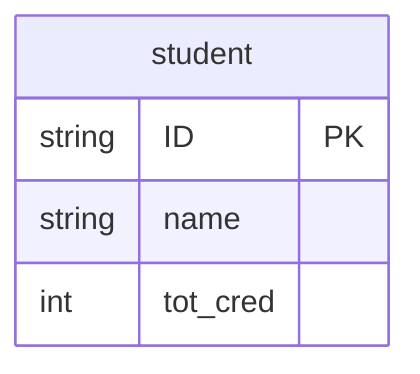
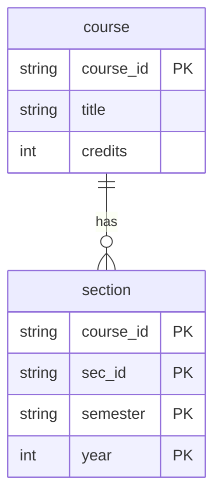
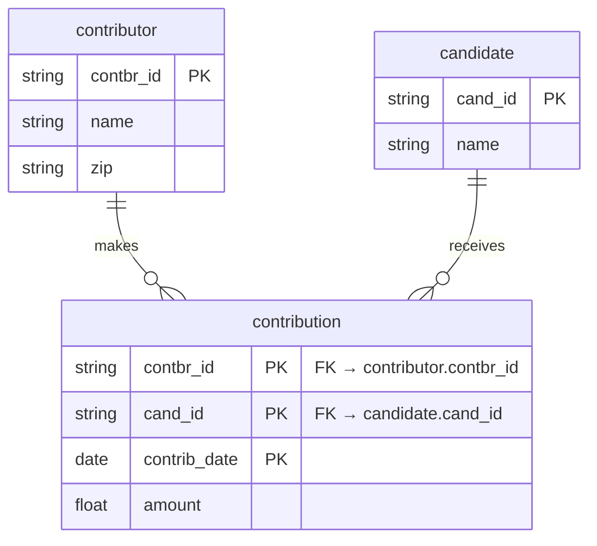
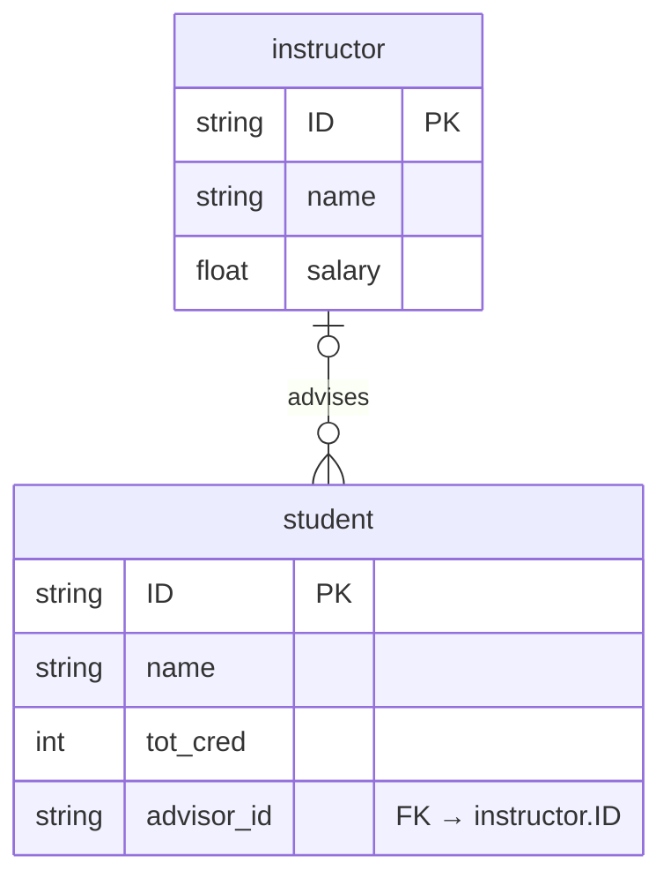
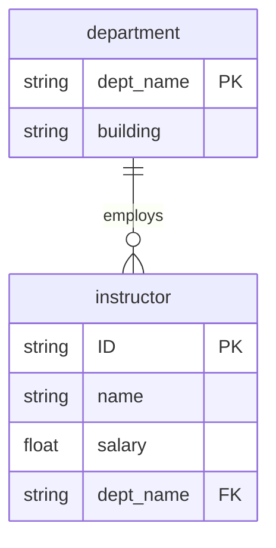
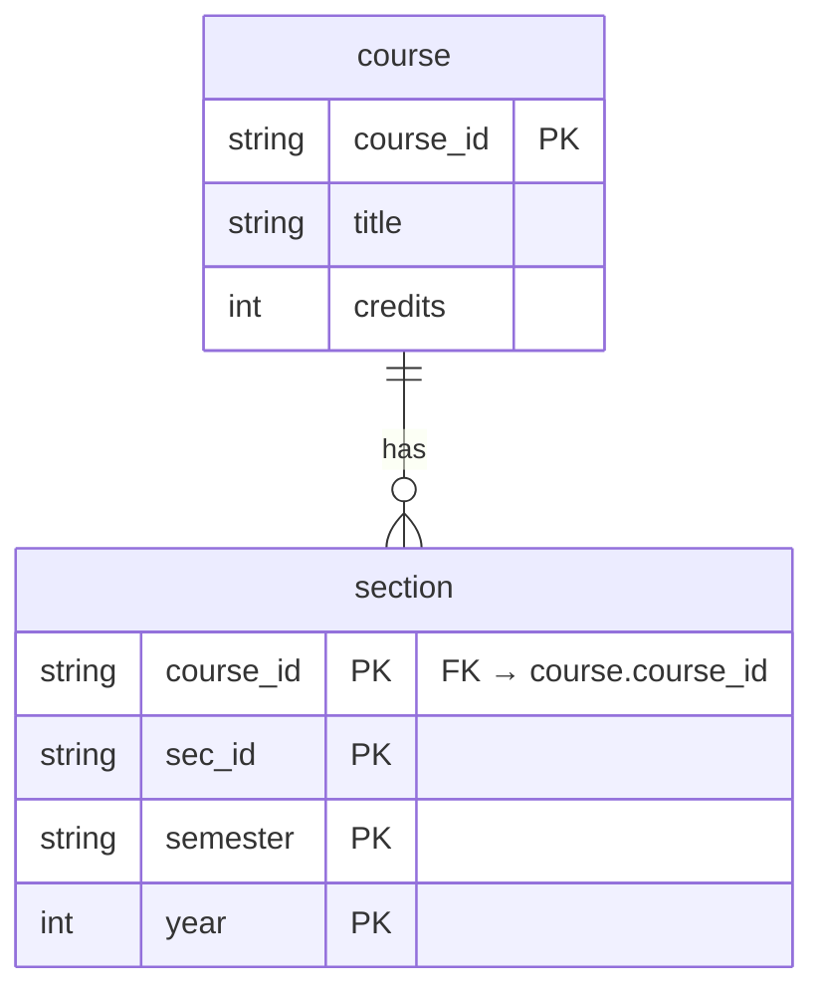

---
# try also 'default' to start simple
theme: seriph
# random image from a curated Unsplash collection by Anthony
# like them? see https://unsplash.com/collections/94734566/slidev
background: https://cover.sli.dev
# some information about your slides (markdown enabled)
title: CST 363
info: |
  ## Deriving Relational Schemas
class: text-center
# https://sli.dev/features/drawing
drawings:
  persist: false
# enable MDC Syntax: https://sli.dev/features/mdc
mdc: true
addons:
  - fancy-arrow
---

# Deriving relational schemas from ER designs

CST 363

---

## Motivation

<div class="p-5">

- The point of conceptual design is to put stakes in the ground and get agreement.
- How to get from the conceptual design to the logical design?

<br>

> Key idea: you can follow a well-defined procedure to go from an ER model to a relational schema.<br>You just need to know the rules.

</div>


---

## Translating a strong entity set

<div class="p-5">


This is the rule for strong entity sets with simple attributes




<br>


⮕ <code>student(<u>ID</u>, name, tot_cred)</code>


</div>

---

## Translating a weak entity set

<div class="p-5">


<div class="grid grid-cols-3 gap-0">

<div class="pl-5">
  


  
</div>

<div class="col-span-2 pl-5">

<br><br><br>

⮕ <code>section(<u>course_id</u>, <u>sec_id</u>, <u>semester</u>, <u>year</u>)</code><br>
$+$ foreign key (`course_id`) references `course(course_id)` 

</div>
</div>


<br>

> Remember: the primary key of a weak entity set $=$<br>
PK of the identifying (owner) entity set $+$ partial key of the weak entity set.<br>
Here: `PK(section) = (course_id, sec_id, semester, year)`


</div>

<!-- 


Two things need to be done:
-add the course_id to get a primary key for section
-add the foreign key constraint
-
IMPORTANT: this slide is not saying anything about how the sec_course
relationship set gets translated – that comes in a few slides.


-->


---


## Translating a relationship set, case 1

<div class="p-5">


<div class="grid grid-cols-2">

<div class="pl-5">



</div>

<div class="pl-0">

⮕ <code>contribution(<u>contbr_id</u>, <u>cand_id</u>, <u>contrib_date</u>, amount)</code> <br>
$+$ foreign key (<code>contbr_id</code>) references <code>contributor(contbr_id)</code> <br>
$+$ foreign key (<code>cand_id</code>) references <code>candidate(cand_id)</code>

</div>

</div>


In many-to-many relationships, use primary keys of related entity sets, <br>plus attributes of the relationship set


</div>


<!-- 

- Granularity assumption: if someone can donate multiple times on the same day, a date isn’t enough. Use a datetime/timestamp (or add a surrogate contrib_id).

- Money type: float is not ideal for currency (rounding). In real schemas you’d use DECIMAL/NUMERIC.

-->


---

## Translating a relationship set, case 2

<div class="p-5">


<div class="grid grid-cols-3">

<div class="pl-5">



</div>

<div class="col-span-2 pl-5">


⮕ <code>student(<u>ID</u>, name, tot_cred, advisor_id)</code> <br>
$+$ foreign key (<code>advisor_id</code>) references <code>instructor(ID)</code>


</div>

</div>


In a 1:N relationship, add the primary key of the “1” side as a foreign key to the “N” side


</div>


<!-- 

Nullability / participation: your ER shows optional on both sides (0..1 advisor per student, 0..N students per instructor). In the relational schema, that means advisor_id should be allowed to be NULL. If you want to teach that explicitly, add “(nullable)” or “advisor_id may be NULL”.

Consistent casing: you use ID in instructor/student; that’s fine, just keep it consistent across all slides (some earlier ones used lowercase like course_id).

-->


---

## Translating a relationship set, exercise

<div class="p-5">





<br>

```
department(dept_name PK, building)

instructor(ID PK, name, salary, dept_name FK NOT NULL)
  FK (dept_name) → DEPARTMENT(dept_name)
```


</div>

<!-- 

The point here is: we know an instructor has:
   - at least one department (participation)
   - at most one department (relationship is many-to-one)

so why not just make the dept_name an attribute of instructor.
-->


---

## Translating a relationship set, case 3

<div class="p-5">


<div class="grid grid-cols-3">

<div class="pl-5">




</div>

<div class="col-span-2 pl-5">

<br><br>


⮕ <code>sec_course(<u>course_id</u>, <u>sec_id</u>, <u>semester</u>, <u>year</u>)</code>


<small>Does this make sense?</small>

> No --- such a relational schema would duplicate the relational schema derived from ‘section’, so no relational schema is produced.<br>This is true for any relationship set linking a weak entity set to its corresponding strong entity set.

</div>


</div>


</div>

<!-- 


to be more precise, could say “identifying relationship” instead of just “relationship set,”


-->


---

## Exercise

<div class="p-5">


```
contributor(contbr_id, name, zip)
candidate(cand_id, name)
contribution(contbr_id, cand_id, contrib_date, amount)

```

</div>


<!-- 


if multiple donations can occur on the same day, use a timestamp or add a surrogate contrib_id.

-->


---


## Summary

<div class="p-5">

You can translate an ER model to a relational schema by following a set of rules.

- an entity set maps to a relation
- attributes of the relation are the attributes of the entity set
- a weak entity set maps to a relation that includes the owner’s primary key (as a foreign key)
- for many-to-many relationships, create a new relation with the keys of the related entity sets + relationship attributes
- for one-to-many relationships, add the key of the “1” side as a foreign key to the “N” side (no new relation)
- create a separate relation for a relationship set only when needed (e.g., many-to-many, or the relationship has its own attributes)

</div>
